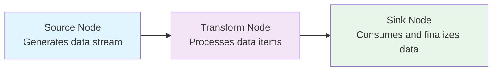

# NPipeline

**High-performance, streaming data pipelines for .NET**

NPipeline is a modern .NET library that makes building complex data processing workflows simple and efficient. Whether you're creating ETL pipelines, processing
real-time data streams, or building sophisticated data transformation workflows, NPipeline provides the tools you need with minimal ceremony.

## Why Choose NPipeline?

### Built for Performance

Stream data efficiently using `IAsyncEnumerable<T>` without loading entire datasets into memory. Perfect for processing large files, database results, or
real-time data streams. NPipeline is designed with performance in mind:

- Streaming architecture minimizes memory allocations and GC pressure
- Zero-reflection execution model with pre-compiled delegates
- Efficient async/await patterns with minimal overhead
- Optimized for high-throughput scenarios

### Graph-Based Architecture

Create sophisticated workflows with multiple data sources, parallel processing, joins, and branching operations. Build complex DAGs (Directed Acyclic
Graphs) with ease.



### Type-Safe by Design

Strongly-typed nodes with compile-time validation prevent common runtime errors. Your IDE will catch type mismatches before you run your code.

### Flexible Execution

Choose the right execution strategy for each node: sequential, parallel, or batched processing. Mix strategies within the same pipeline.

### Production-Ready Resilience

Built-in error handling with retry strategies, circuit breakers, and dead letter queues. Create robust pipelines that handle failures gracefully with
intelligent backoff and jitter patterns to prevent thundering herd problems.

## Common Use Cases

NPipeline excels in scenarios where you need to process data efficiently and reliably:

- **ETL Pipelines** - Extract data from databases, APIs, or files; transform it; load it into data warehouses
- **Data Migration** - Move and transform data between systems with validation and error handling
- **Real-time Processing** - Process streaming data from message queues, IoT devices, or APIs
- **File Processing** - Parse, validate, and transform large CSV, JSON, or XML files
- **API Integration** - Fetch data from multiple APIs, combine results, and sync to your systems
- **Data Validation** - Clean and validate data with complex business rules and error reporting
- **Report Generation** - Aggregate data from multiple sources and generate reports or exports
- **Batch Processing** - Process large datasets efficiently with parallel execution and state management

## Key Concepts

**Nodes** are the building blocks of your pipeline:

- **Sources** generate or fetch data (`SourceNode<T>`)
- **Transforms** process data item by item (`TransformNode<TIn, TOut>`)
- **Sinks** consume data and perform final operations (`SinkNode<T>`)

**Data Pipes** transport data between nodes as strongly-typed async streams (`IDataPipe<T>`).

**Pipeline Context** provides logging, cancellation, error handling, and shared state without carrying data payloads.

**Execution Strategies** control how nodes process data: sequential, parallel, or batched processing.

## Prerequisites

NPipeline requires .NET 8.0, .NET 9.0 or .NET 10.0 to take advantage of the latest performance improvements and language features.

The core library is dependency-free.

## Quick Start

Install the core package to get started:

```bash
dotnet add package NPipeline
dotnet add package NPipeline.DependencyInjection
```

Additionally, install the Analyzer package to enable Roslyn analyzers that provide compile-time checks and guardrails:

```bash
dotnet add package NPipeline.Analyzers
```

## Simple Example

Here's a basic pipeline that processes customer orders:

```csharp
// 1. Define your data models
public record Order(int Id, string Customer, decimal Amount);
public record ProcessedOrder(int Id, string Customer, decimal Amount, decimal Tax, decimal Total);

// 2. Create pipeline nodes
public class OrderSource : SourceNode<Order>
{
    public override IDataPipe<Order> Initialize(PipelineContext context, CancellationToken cancellationToken)
    {
        var orders = new[]
        {
            new Order(1, "Alice", 100m),
            new Order(2, "Bob", 250m),
            new Order(3, "Carol", 75m)
        };

        return new StreamingDataPipe<Order>(orders.ToAsyncEnumerable());
    }
}

public class TaxCalculator : TransformNode<Order, ProcessedOrder>
{
    public override Task<ProcessedOrder> ExecuteAsync(Order order, PipelineContext context, CancellationToken cancellationToken)
    {
        var tax = order.Amount * 0.08m;
        var total = order.Amount + tax;

        return Task.FromResult(new ProcessedOrder(order.Id, order.Customer, order.Amount, tax, total));
    }
}

public class OrderSink : SinkNode<ProcessedOrder>
{
    public override async Task ExecuteAsync(IDataPipe<ProcessedOrder> input, PipelineContext context, CancellationToken cancellationToken)
    {
        await foreach (var order in input.WithCancellation(cancellationToken))
        {
            Console.WriteLine($"Order {order.Id}: {order.Customer} - Total: ${order.Total:F2}");
        }
    }
}

// 3. Define the pipeline
public class OrderPipeline : IPipelineDefinition
{
    public void Define(PipelineBuilder builder, PipelineContext context)
    {
        var source = builder.AddSource<OrderSource, Order>("Order Source");
        var calculator = builder.AddTransform<TaxCalculator, Order, ProcessedOrder>("Tax Calculator");
        var sink = builder.AddSink<OrderSink, ProcessedOrder>("Order Sink");

        builder.Connect(source, calculator);
        builder.Connect(calculator, sink);
    }
}

// 4. Run the pipeline
var services = new ServiceCollection()
    .AddNPipeline(typeof(Program).Assembly)
    .BuildServiceProvider();

await services.RunPipelineAsync<OrderPipeline>();
```

## Available Packages

NPipeline is modular - install only what you need.

While the core NPipeline library provides a powerful foundation for streaming data pipelines, the available extensions and connectors provide enhanced opt-in
functionality and features like enhanced parallelism, simplifying testing workflows, and connecting to external systems with minimal friction.

| Package                                      | Purpose                                                                                              |
|----------------------------------------------|------------------------------------------------------------------------------------------------------|
| **NPipeline**                                | Core streaming pipeline functionality (zero dependencies)                                            |
| **NPipeline.Analyzers**                      | Roslyn analyzers for compile-time validation, style guidance, and developer guardrails               |
| **NPipeline.Extensions.DependencyInjection** | Integration with Microsoft DI container                                                              |
| **NPipeline.Extensions.Parallelism**         | Parallel processing with TPL Dataflow                                                                |
| **NPipeline.Extensions.Testing**             | Testing utilities and extensions for assertion libraries like FluentAssertions and AwesomeAssertions |
| **NPipeline.Connectors**                     | Core abstractions for data format/storage decoupling                                                 |
| **NPipeline.Connectors.Csv**                 | CSV source and sink nodes                                                                            |
| **NPipeline.Connectors.Excel**               | Excel source and sink nodes for XLS and XLSX files                                                   |

... and more to come.

## What's Next?

1. **[Installation](docs/getting-started/installation.md)** - Set up NPipeline in your project
2. **[Quick Start](docs/getting-started/quick-start.md)** - Build a complete pipeline step-by-step
3. **[Core Concepts](docs/core-concepts/index.md)** - Learn the fundamentals of NPipeline

## Transparency: AI-Assisted Development

This project leverages modern AI and LLM tools to enhance productivity in test generation, documentation, XML code comments and sample generation. We believe transparency about development practices is important.

All AI-generated content is carefully reviewed for accuracy, quality, and alignment with project standards before being included. The core library logic, architecture decisions, and critical functionality remain carefully designed and reviewed. Our goal is to use AI as a productivity multiplier while maintaining the high standards of a production-ready library.

## Contributing

Contributions are welcome! Please feel free to open an issue or submit a pull request.

## License

NPipeline is licensed under the [MIT License](LICENSE).
