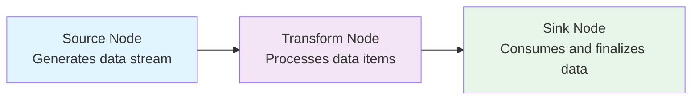

# NPipeline

**High-performance, streaming data pipelines for .NET**

NPipeline is a modern .NET library that makes building complex data processing workflows simple and efficient. Whether you're creating ETL pipelines, processing
real-time data streams, or building sophisticated data transformation workflows, NPipeline provides the tools you need with minimal ceremony.

## Why Choose NPipeline?

### Built for Performance

Stream data efficiently using `IAsyncEnumerable<T>` without loading entire datasets into memory. Perfect for processing large files, database results, or
real-time data streams. NPipeline is designed with performance in mind:

- Streaming architecture minimizes memory allocations and GC pressure
- Zero-reflection execution model with pre-compiled delegates
- Efficient async/await patterns with minimal overhead
- Optimized for high-throughput scenarios

### Graph-Based Architecture

Create sophisticated workflows with multiple data sources, parallel processing, joins, and branching operations. Build complex DAGs (Directed Acyclic
Graphs) with ease.



### Type-Safe by Design

Strongly-typed nodes with compile-time validation prevent common runtime errors. Your IDE will catch type mismatches before you run your code.

### Flexible Execution

Choose the right execution strategy for each node: sequential, parallel, or batched processing. Mix strategies within the same pipeline.

### Production-Ready Resilience

Built-in error handling with retry strategies, circuit breakers, and dead letter queues. Create robust pipelines that handle failures gracefully with
intelligent backoff and jitter patterns to prevent thundering herd problems.

## Common Use Cases

NPipeline excels in scenarios where you need to process data efficiently and reliably:

- **ETL Pipelines** - Extract data from databases, APIs, or files; transform it; load it into data warehouses
- **Data Migration** - Move and transform data between systems with validation and error handling
- **Real-time Processing** - Process streaming data from message queues, IoT devices, or APIs
- **File Processing** - Parse, validate, and transform large CSV, JSON, or XML files
- **API Integration** - Fetch data from multiple APIs, combine results, and sync to your systems
- **Data Validation** - Clean and validate data with complex business rules and error reporting
- **Report Generation** - Aggregate data from multiple sources and generate reports or exports
- **Batch Processing** - Process large datasets efficiently with parallel execution and state management

## Key Concepts

**Nodes** are the building blocks of your pipeline:

- **Sources** generate or fetch data (`SourceNode<T>`)
- **Transforms** process data item by item (`TransformNode<TIn, TOut>`)
- **Sinks** consume data and perform final operations (`SinkNode<T>`)

**Data Pipes** transport data between nodes as strongly-typed async streams (`IDataPipe<T>`).

**Pipeline Context** provides logging, cancellation, error handling, and shared state without carrying data payloads.

**Execution Strategies** control how nodes process data: sequential, parallel, or batched processing.

## Prerequisites

NPipeline requires .NET 8.0, .NET 9.0 or .NET 10.0 to take advantage of the latest performance improvements and language features.

The core library is dependency-free.

## Quick Start

Install the core package to get started:

```bash
dotnet add package NPipeline
dotnet add package NPipeline.DependencyInjection
```

Additionally, install the Analyzer package to enable Roslyn analyzers that provide compile-time checks and guardrails:

```bash
dotnet add package NPipeline.Analyzers
```

## Simple Example

Here's a basic pipeline that processes customer orders:

```csharp
// 1. Define your data models
public record Order(int Id, string Customer, decimal Amount);
public record ProcessedOrder(int Id, string Customer, decimal Amount, decimal Tax, decimal Total);

// 2. Create pipeline nodes
public class OrderSource : SourceNode<Order>
{
    public override Task<IDataPipe<Order>> ExecuteAsync(PipelineContext context, CancellationToken cancellationToken)
    {
        var orders = new[]
        {
            new Order(1, "Alice", 100m),
            new Order(2, "Bob", 250m),
            new Order(3, "Carol", 75m)
        };

        return Task.FromResult<IDataPipe<Order>>(new StreamingDataPipe<Order>(orders.ToAsyncEnumerable()));
    }
}

public class TaxCalculator : TransformNode<Order, ProcessedOrder>
{
    public override Task<ProcessedOrder> ExecuteAsync(Order order, PipelineContext context, CancellationToken cancellationToken)
    {
        var tax = order.Amount * 0.08m;
        var total = order.Amount + tax;

        return Task.FromResult(new ProcessedOrder(order.Id, order.Customer, order.Amount, tax, total));
    }
}

public class OrderSink : SinkNode<ProcessedOrder>
{
    public override async Task ExecuteAsync(IDataPipe<ProcessedOrder> input, PipelineContext context, CancellationToken cancellationToken)
    {
        await foreach (var order in input.WithCancellation(cancellationToken))
        {
            Console.WriteLine($"Order {order.Id}: {order.Customer} - Total: ${order.Total:F2}");
        }
    }
}

// 3. Define the pipeline
public class OrderPipeline : IPipelineDefinition
{
    public void Define(PipelineBuilder builder, PipelineContext context)
    {
        var source = builder.AddSource<OrderSource, Order>("Order Source");
        var calculator = builder.AddTransform<TaxCalculator, Order, ProcessedOrder>("Tax Calculator");
        var sink = builder.AddSink<OrderSink, ProcessedOrder>("Order Sink");

        builder.Connect(source, calculator);
        builder.Connect(calculator, sink);
    }
}

// 4. Run the pipeline
var services = new ServiceCollection()
    .AddNPipeline(typeof(Program).Assembly)
    .BuildServiceProvider();

await services.RunPipelineAsync<OrderPipeline>();
```

## Available Packages

NPipeline is modular - install only what you need.

While the core NPipeline library provides a powerful foundation for streaming data pipelines, the available extensions and connectors provide enhanced opt-in
functionality and features like enhanced parallelism, simplifying testing workflows, and connecting to external systems with minimal friction.

| Package                                      | Purpose                                                                                              |
|----------------------------------------------|------------------------------------------------------------------------------------------------------|
| **NPipeline**                                | Core streaming pipeline functionality (zero dependencies)                                            |
| **NPipeline.Analyzers**                      | Roslyn analyzers for compile-time validation, style guidance, and developer guardrails               |
| **NPipeline.Extensions.DependencyInjection** | Integration with Microsoft DI container                                                              |
| **NPipeline.Extensions.Parallelism**         | Parallel processing with TPL Dataflow                                                                |
| **NPipeline.Extensions.Testing**             | Testing utilities and extensions for assertion libraries like FluentAssertions and AwesomeAssertions |
| **NPipeline.Connectors**                     | Core abstractions for data format/storage decoupling                                                 |
| **NPipeline.Connectors.Csv**                 | CSV source and sink nodes                                                                            |

... and more to come.

## Documentation

### Getting Started

- **[Introduction](docs/introduction/index.md)** - What is NPipeline and when to use it
- **[Why NPipeline](docs/introduction/why-npipeline.md)** - Key benefits and features
- **[Installation](docs/getting-started/installation.md)** - Set up NPipeline in your project
- **[Quick Start](docs/getting-started/quick-start.md)** - Build a complete pipeline step-by-step

### Core Concepts

- **[Core Concepts Overview](docs/core-concepts/index.md)** - Fundamental NPipeline concepts
- **[Pipeline Definition](docs/core-concepts/pipeline-definition.md)** - How to define and structure pipelines
- **[Nodes](docs/core-concepts/nodes/index.md)** - Source, Transform, and Sink nodes
    - **[Source Nodes](docs/core-concepts/nodes/source-nodes.md)** - Creating data sources
    - **[Transform Nodes](docs/core-concepts/nodes/transform-nodes.md)** - Processing data
    - **[Sink Nodes](docs/core-concepts/nodes/sink-nodes.md)** - Consuming data
- **[Data Pipes](docs/core-concepts/data-pipes.md)** - Understanding data flow between nodes
- **[Pipeline Context](docs/core-concepts/pipeline-context.md)** - Logging, cancellation, and shared state
- **[IPipeline](docs/core-concepts/ipipeline.md)** - The executable instance of a pipeline
- **[INode](docs/core-concepts/inode.md)** - The fundamental unit of work in a pipeline
- **[PipelineBuilder](docs/core-concepts/pipelinebuilder.md)** - Fluent API for creating pipeline definitions
- **[Pipeline Validation](docs/core-concepts/pipeline-validation.md)** - Ensuring pipeline correctness
- **[Grouping Strategies](docs/core-concepts/grouping-strategies.md)** - Organizing data in pipelines
- **[Streaming vs Buffering](docs/core-concepts/streaming-vs-buffering.md)** - Memory and performance considerations

### Pipeline Execution & Resilience

- **[Execution Strategies](docs/core-concepts/pipeline-execution/execution-strategies.md)** - Sequential, parallel, and batch processing
- **[Pipeline Execution](docs/core-concepts/pipeline-execution/index.md)** - Complete execution guide
    - **[Error Handling](docs/core-concepts/pipeline-execution/error-handling.md)** - Managing errors
    - **[Node Error Handling](docs/core-concepts/pipeline-execution/node-error-handling.md)** - Node-level error management
    - **[Pipeline Error Handling](docs/core-concepts/pipeline-execution/pipeline-error-handling.md)** - Pipeline-level error management
    - **[Retry Configuration](docs/core-concepts/pipeline-execution/retry-configuration.md)** - Setting up retries
    - **[Circuit Breaker Configuration](docs/core-concepts/pipeline-execution/circuit-breaker-configuration.md)** - Preventing cascading failures
    - **[Dead Letter Queues](docs/core-concepts/pipeline-execution/dead-letter-queues.md)** - Handling failed items
    - **[IPipelineRunner](docs/core-concepts/pipeline-execution/ipipelinerunner.md)** - Running pipelines
- **[Resilience](docs/core-concepts/resilience/index.md)** - Building fault-tolerant pipelines
    - **[Node Restart Quickstart](docs/core-concepts/resilience/node-restart-quickstart.md)** - Getting started with resilient execution
    - **[Resilient Execution Strategy](docs/core-concepts/resilience/resilient-execution-strategy.md)** - Enhanced resilience patterns
    - **[Configuration Guide](docs/core-concepts/resilience/configuration-guide.md)** - Resilience configuration
    - **[Dependency Chains](docs/core-concepts/resilience/dependency-chains.md)** - Managing node dependencies
    - **[Materialization and Buffering](docs/core-concepts/resilience/materialization-and-buffering.md)** - Data persistence strategies
    - **[Circuit Breaker Enhanced Configuration](docs/core-concepts/resilience/circuit-breaker-advanced-configuration.md)** - Enhanced breaker setup
    - **[Troubleshooting](docs/core-concepts/resilience/troubleshooting.md)** - Common resilience issues

### Specialized Node Types

- **[Specialized Node Types Overview](docs/core-concepts/nodes/index.md)** - Specialized node types for specific use cases
- **[Aggregation](docs/core-concepts/nodes/aggregation.md)** - Combining multiple items
- **[Batching](docs/core-concepts/nodes/batching.md)** - Processing data in batches
- **[Branch](docs/core-concepts/nodes/branch.md)** - Splitting data flows
- **[Join](docs/core-concepts/nodes/join.md)** - Combining data from multiple sources
- **[Time-Windowed Join](docs/core-concepts/nodes/time-windowed-join.md)** - Joining with time constraints
- **[Lookup](docs/core-concepts/nodes/lookup.md)** - Enriching data with lookups
- **[Tap](docs/core-concepts/nodes/tap.md)** - Non-intrusive monitoring and side-channel processing
- **[ValueTask Transforms](docs/core-concepts/nodes/valuetask-transforms.md)** - High-performance transformations

### Best Practices & Patterns

- **[Best Practices](docs/core-concepts/best-practices.md)** - Recommended approaches and guidelines
- **[Common Patterns](docs/core-concepts/common-patterns.md)** - Practical implementation patterns

### Extensions

- **[Extensions Overview](docs/extensions/index.md)** - Available extensions
- **[Dependency Injection](docs/extensions/dependency-injection.md)** - Integration with Microsoft DI container
- **[Parallelism](docs/extensions/parallelism.md)** - High-performance parallel processing
- **[Testing](docs/extensions/testing/index.md)** - Testing utilities and best practices
    - **[FluentAssertions Integration](docs/extensions/testing/fluent-assertions.md)** - Using FluentAssertions
    - **[AwesomeAssertions Integration](docs/extensions/testing/awesome-assertions.md)** - Using AwesomeAssertions

### Analyzers

- **[Analyzers Overview](docs/analyzers/index.md)** - Roslyn analyzers for code quality
- **[Best Practices Analyzer](docs/analyzers/best-practices.md)** - Code quality guidelines
- **[Data Processing Analyzer](docs/analyzers/data-processing.md)** - Data handling best practices
- **[Performance Analyzer](docs/analyzers/performance.md)** - Performance optimization guidance
- **[Resilience Analyzer](docs/analyzers/resilience.md)** - Resilience pattern detection

### Connectors

- **[Connectors Overview](docs/connectors/index.md)** - Pre-built components for external systems
- **[CSV Connector](docs/connectors/csv.md)** - Read from/write to CSV files
- **[Storage Provider](docs/connectors/storage-provider.md)** - Building custom storage connectors

### Additional Topics

- **[Performance Hygiene](docs/advanced-topics/performance-hygiene.md)** - Optimization and benchmarking
- **[Synchronous Fast Paths](docs/advanced-topics/synchronous-fast-paths.md)** - Zero-allocation patterns
- **[Testing Pipelines](docs/advanced-topics/testing-pipelines.md)** - Best practices for testing your pipelines

### Architecture & Design

- **[Architecture Overview](docs/architecture/index.md)** - Understanding NPipeline's design
- **[Component Architecture](docs/architecture/component-architecture.md)** - Core components
- **[Design Principles](docs/architecture/design-principles.md)** - Guiding principles
- **[Core Concepts](docs/architecture/core-concepts.md)** - Architectural concepts
- **[Data Flow](docs/architecture/data-flow.md)** - How data moves through the system
- **[Execution Flow](docs/architecture/execution-flow.md)** - How pipelines execute
- **[Error Handling Architecture](docs/architecture/error-handling-architecture.md)** - Error handling design
- **[Cancellation Model](docs/architecture/cancellation-model.md)** - Cancellation implementation
- **[Dependency Injection](docs/architecture/dependency-injection.md)** - DI patterns
- **[Extension Points](docs/architecture/extension-points.md)** - Extensibility mechanisms
- **[Optimization Principles](docs/architecture/optimization-principles.md)** - Performance optimization
- **[Performance Characteristics](docs/architecture/performance-characteristics.md)** - Performance metrics

### Reference & Support

- **[API Reference](docs/introduction/api-reference.md)** - Complete API documentation
- **[FAQ](docs/introduction/faq.md)** - Frequently asked questions
- **[Troubleshooting](docs/introduction/troubleshooting.md)** - Common issues and solutions
- **[Error Codes](docs/reference/error-codes.md)** - Error code reference

## What's Next?

1. **Start Simple** - Follow the [Quick Start](docs/getting-started/quick-start.md) tutorial
2. **Learn the Core** - Explore the [Core Concepts](docs/core-concepts/index.md)
3. **Scale Up** - Explore [parallel processing](docs/extensions/parallelism.md) for better performance

## Contributing

Contributions are welcome! Please feel free to open an issue or submit a pull request.

## License

NPipeline is licensed under the [MIT License](LICENSE).
