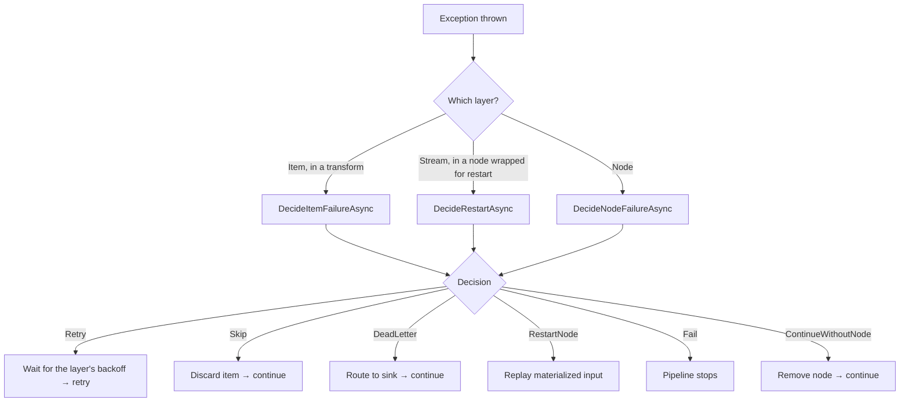

# Error Handling

NPipeline distinguishes three levels of failure. Each level has different causes, different recovery options, and different configuration points.

## The Three Failure Levels

### Item-Level Failures

An individual item throws an exception during processing inside a transform node. The item fails, but the stream can continue.

**Example:** A single malformed record causes a `FormatException` in a CSV parser while other records process normally.

**Recovery options:** Retry the item, skip it, or route it to a dead-letter queue.

### Node-Level Failures

An entire node fails - typically because its stream is exhausted or an unrecoverable error occurs (e.g., a database connection drops mid-stream).

**Example:** A source node's HTTP connection times out after the stream has started.

**Recovery options:** Restart the node (replaying materialized items), continue without the node, or fail the pipeline.

### Pipeline-Level Failures

The pipeline itself cannot continue - either because a critical node failed with no recovery path, or because a circuit breaker tripped.

**Example:** A circuit breaker opens after 5 consecutive node restart failures.

**Recovery options:** Fail fast with a clear error message. Investigate and fix the root cause.

## Decision Model

When a failure occurs, NPipeline consults your **resilience policy** to decide what to do. The policy returns one of six decisions:

| Decision | Meaning |
|----------|---------|
| `Fail` | Stop the pipeline immediately. Surface the exception. |
| `Retry` | Retry the failed operation, after the layer's backoff. |
| `Skip` | Discard the failed item and continue processing. |
| `DeadLetter` | Route the failed item to a dead-letter sink for later inspection. |
| `RestartNode` | Restart the entire failed node from its materialized input. |
| `ContinueWithoutNode` | Remove the failed node and continue the pipeline without it. |

These decisions are defined in the `ResilienceDecision` enum (`NPipeline.Reliability` namespace).

## Default Behavior

Each node's `PipelineResilienceOptions` describe what is retried, and `DefaultResiliencePolicy` carries them out. The options start from the [optimization profile](../guides/optimization-profiles.md):

**Default profile:** transient item failures are retried up to 3 times, with exponential backoff from 200 ms up to 30 s and full jitter (`ItemRetryOptions.Default`).

Transient failures include:
- `TimeoutException`, `IOException`, and `SocketException`
- `HttpRequestException` (no status or status 408, 429, or 5xx)
- `DbException` where `IsTransient` is true
- `TaskCanceledException` (unless caused by the pipeline's own token)

Any other failure fails the node at once, so a programming error is not retried.

**HighThroughput profile:** nothing is retried (`PipelineResilienceOptions.None`).

In both profiles:

- An item that is not retried fails the node unless you set `OnItemFailure` to `Skip` or `DeadLetter`.
- Node restart (`NodeRestart`) and node retry (`NodeRetry`) are off until you configure them.
- `OnItemFailure = DeadLetter` without a dead-letter sink stops the run before any node starts. A custom policy that returns `DeadLetter` without a sink fails the node with `DeadLetterSinkNotConfiguredException` ([NP0424](../reference/error-codes.md)). The item is never dropped silently.
- A failure that is not retried fails the pipeline. This is intentional: silent data loss is worse than a loud failure.

A custom policy registered with `AddResiliencePolicy()` makes the decisions instead. The node's limits are passed to it as advice (`failure.MaxRetries`, `failure.CanRetry`); the runtime does not override its answer, except that repeating the same work more than 100 times fails the node.

## Configuring Error Handling

Error handling is configured on the `PipelineBuilder` inside your pipeline definition:

```csharp
public class MyPipeline : IPipelineDefinition
{
    public void Define(PipelineBuilder builder, PipelineContext context)
    {
        // 1. Configure the pipeline's resilience options, starting from the profile's defaults.
        builder.WithResilience(options => options with
        {
            ItemRetry = options.ItemRetry with { MaxRetries = 5 },
            OnItemFailure = ItemFailureAction.DeadLetter,
            CircuitBreaker = new CircuitBreakerOptions { ConsecutiveFailures = 5, OpenDuration = TimeSpan.FromMinutes(1) },
        });

        // 2. Add a dead-letter sink (where failed items go).
        builder.AddDeadLetterSink(new BoundedInMemoryDeadLetterSink());

        // 3. Optionally, add a resilience policy with your own decision logic.
        builder.AddResiliencePolicy(myPolicy);

        // ... add nodes and connections ...
    }
}
```

A node's options derive from the pipeline's. Override them for one node with `WithResilience(handle, ...)`:

```csharp
builder.WithResilience(enrich, options => options with
{
    ItemRetry = options.ItemRetry with { MaxRetries = 10 },
});
```

## How Failures Flow



## Enabling Resilience on a Node

To enable retry/restart behavior on a specific transform node, call `.WithResilience()`:

```csharp
var transform = builder.AddTransform<MyTransform, string, string>("my-transform");
transform.WithResilience(builder);
```

This wraps the node's execution strategy with `ResilientExecutionStrategy`. The node restarts only as often as its `NodeRestart.MaxRestarts` allows (or a custom policy asks), waiting `NodeRestart.Backoff` between runs:

```csharp
builder.WithResilience(transform, options => options with
{
    NodeRestart = new NodeRestartOptions { MaxRestarts = 3 },
});
```

> **Note:** Resilience is only applicable to transform nodes. Source and sink nodes handle errors through the node-level and pipeline-level decision methods.

## Key Namespaces

| Namespace | Contains |
|-----------|----------|
| `NPipeline.Reliability` | `PipelineResilienceOptions`, `ItemRetryOptions`, `NodeRestartOptions`, `NodeRetryOptions`, `CircuitBreakerOptions`, `BreakerOpenBehavior`, `RetryBackoff`, `RetryClassifier`, `IResiliencePolicy`, `ResiliencePolicyBase`, `ResilienceDecision` |
| `NPipeline.ErrorHandling` | `ResiliencePolicyBuilder`, `IDeadLetterSink`, `DeadLetterEnvelope`, `CircuitBreakerOpenException` |

## In This Section

- [Resilience Policies](resilience-policies.md) - implement custom decision logic with the fluent builder
- [Retry Strategies](retry-strategies.md) - configure exponential, linear, or fixed backoff with jitter
- [Circuit Breakers](circuit-breakers.md) - stop calling a dependency that keeps failing, and fail or pause until it recovers
- [Dead-Letter Queues](dead-letter-queues.md) - capture and inspect failed items
- [Materialization](materialization.md) - buffer streaming inputs to enable node restart
