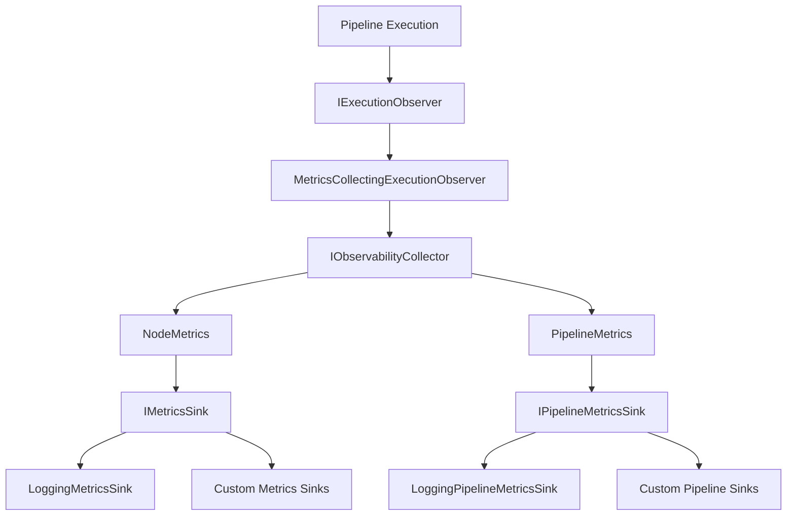

# Observability

The `NPipeline.Extensions.Observability` extension provides comprehensive metrics collection and monitoring capabilities for NPipeline pipelines. It enables detailed tracking of pipeline execution, node performance, throughput, and resource utilization, making it easier to identify bottlenecks, optimize performance, and troubleshoot issues in production environments.

## Overview

Observability is critical for understanding how data pipelines behave in production. This extension provides:

- **Node-level metrics**: Track execution time, items processed/emitted, retries, memory usage, and processor time for each node
- **Pipeline-level metrics**: Aggregate metrics across all nodes, including total duration, throughput, and success/failure status
- **Thread-safe collection**: Metrics are collected safely across parallel and concurrent pipeline executions
- **Flexible sinks**: Built-in logging sinks with support for custom metrics sinks (e.g., Application Insights, Prometheus, OpenTelemetry)
- **Dependency injection integration**: Seamlessly integrates with Microsoft.Extensions.DependencyInjection
- **Execution observer pattern**: Hooks into the pipeline execution lifecycle to capture metrics without modifying node logic

## Key Features

### Comprehensive Metrics Collection

The extension captures detailed metrics at multiple levels:

- **Execution timing**: Start/end timestamps and duration for nodes and pipelines
- **Throughput tracking**: Items processed per second for performance analysis
- **Resource utilization**: Peak memory usage and processor time for each node
- **Retry monitoring**: Tracks retry attempts with reasons for failure analysis
- **Error tracking**: Captures exceptions with full context for debugging

### Thread-Safe Design

Built for production environments with concurrent pipeline executions:

- Uses `ConcurrentDictionary` for thread-safe metrics aggregation
- Atomic operations for counter updates using `Interlocked` operations
- Scoped lifetime ensures isolation between pipeline runs
- Safe for parallel execution strategies and multi-threaded scenarios

### Flexible Integration

Multiple registration options to fit different scenarios:

- Default registration with built-in logging sinks
- Custom metrics sinks for external monitoring systems
- Factory delegates for complex initialization scenarios
- Custom collector implementations for specialized metrics needs

## Installation

Install the NuGet package:

```bash
dotnet add package NPipeline.Extensions.Observability
```

The extension requires:
- `NPipeline` (core package)
- `Microsoft.Extensions.DependencyInjection.Abstractions` (10.0.1 or later)
- `Microsoft.Extensions.Logging.Abstractions` (10.0.1 or later)

## Quick Start

### Basic Setup with Default Logging

The simplest way to enable observability is with the default registration:

```csharp
using Microsoft.Extensions.DependencyInjection;
using NPipeline.Observability.DependencyInjection;

var services = new ServiceCollection();

// Add observability with default logging sinks
services.AddNPipelineObservability();

// Add NPipeline core services
services.AddNPipeline(Assembly.GetExecutingAssembly());

var serviceProvider = services.BuildServiceProvider();

// Run your pipeline - metrics will be automatically collected and logged
await serviceProvider.RunPipelineAsync<MyPipelineDefinition>();
```

### What Gets Logged

With the default configuration, you'll see structured logs like:

```
[Information] Pipeline MyPipeline (RunId: 123e4567-e89b-12d3-a456-426614174000) completed successfully. Processed 1000 items in 2500ms
[Information]   Node TransformNode: Processed 1000 items, emitted 950 items in 1200ms
[Information]   Node FilterNode: Processed 950 items, emitted 800 items in 800ms
[Information]   Node SinkNode: Processed 800 items, emitted 800 items in 500ms
[Information] Overall pipeline throughput: 400.00 items/sec
```

### Automatic Metrics Collection with IObservablePipelineContextFactory

The simplest way to enable automatic metrics collection is to use the `IObservablePipelineContextFactory`:

```csharp
using Microsoft.Extensions.DependencyInjection;
using NPipeline.Observability;
using NPipeline.Observability.DependencyInjection;

// Register observability services
services.AddNPipelineObservability();

// In your pipeline execution code:
await using var scope = host.Services.CreateAsyncScope();
var runner = scope.ServiceProvider.GetRequiredService<IPipelineRunner>();

// Create a context with observability pre-configured
var contextFactory = scope.ServiceProvider.GetRequiredService<IObservablePipelineContextFactory>();
await using var context = contextFactory.Create();

// Run your pipeline - metrics are collected automatically!
await runner.RunAsync<MyPipeline>(context);

// Retrieve collected metrics
var collector = scope.ServiceProvider.GetRequiredService<IObservabilityCollector>();
var nodeMetrics = collector.GetNodeMetrics();

foreach (var metrics in nodeMetrics)
{
    Console.WriteLine($"Node {metrics.NodeId}: {metrics.DurationMs}ms, Success: {metrics.Success}");
}
```

The `IObservablePipelineContextFactory` automatically sets up the `ExecutionObserver` on the context, so you don't need to manually wire up the observer.

### Per-Node Observability Configuration

You can configure observability options for individual nodes using the `WithObservability()` extension method:

```csharp
using NPipeline.Observability;
using NPipeline.Observability.Configuration;

public class MyPipeline : IPipelineDefinition
{
    public void Define(PipelineBuilder builder, PipelineContext context)
    {
        var source = builder.AddSource<MySource, int>();
        
        // Configure with default options
        var transform = builder.AddTransform<MyTransform, int, string>()
            .WithObservability(builder);
        
        // Configure with full options (includes memory tracking)
        var sink = builder.AddSink<MySink, string>()
            .WithObservability(builder, ObservabilityOptions.Full);
        
        builder.Connect(source, transform);
        builder.Connect(transform, sink);
    }
}
```

### ObservabilityOptions Presets

| Preset | Timing | Item Counts | Memory | Thread Info | Performance |
|--------|--------|-------------|--------|-------------|-------------|
| `Default` | ✓ | ✓ | ✗ | ✓ | ✓ |
| `Full` | ✓ | ✓ | ✓ | ✓ | ✓ |
| `Minimal` | ✓ | ✗ | ✗ | ✗ | ✗ |
| `Disabled` | ✗ | ✗ | ✗ | ✗ | ✗ |

## When to Use This Extension

Use the Observability extension when:

- **Production monitoring**: You need to track pipeline performance in production environments
- **Performance optimization**: You want to identify bottlenecks and optimize node execution
- **Error diagnosis**: You need detailed error context and retry information
- **Capacity planning**: You need to understand resource utilization (memory, CPU) for scaling decisions
- **SLA monitoring**: You need to track throughput and latency to meet service level agreements
- **Debugging**: You want to understand pipeline behavior without modifying node code

## Performance Characteristics

### Minimal Overhead

The extension is designed for production use with minimal performance impact:

- **Non-blocking metrics collection**: Metrics are recorded asynchronously without blocking pipeline execution
- **Efficient data structures**: Uses optimized collections for metrics aggregation
- **Optional observability**: Can be disabled entirely by not registering the services
- **Scoped lifetime**: Metrics are isolated per pipeline run, preventing memory leaks

### Memory Usage

- **Per-pipeline overhead**: Approximately 1-2 KB per node for metrics storage
- **Transient sinks**: Metrics sinks are created per pipeline run and disposed after use
- **No persistent storage**: Metrics are not retained in memory beyond the pipeline execution

### CPU Impact

- **Lightweight timing**: Uses high-resolution timers with minimal CPU overhead
- **Optional performance counters**: Memory and processor time collection can be disabled if not needed
- **Batch-friendly**: Metrics collection scales efficiently with large batch sizes

## Architecture

The extension follows a layered architecture:



### Key Components

- **`MetricsCollectingExecutionObserver`**: Hooks into pipeline execution lifecycle to capture metrics
- **`ObservabilityCollector`**: Thread-safe collector that aggregates metrics from all nodes
- **`IMetricsSink` / `IPipelineMetricsSink`**: Abstractions for emitting metrics to various destinations
- **`IObservabilityFactory`**: DI-aware factory for resolving observability components

## Thread-Safety Guarantees

The extension provides strong thread-safety guarantees:

- **Concurrent metrics collection**: Multiple nodes can record metrics simultaneously without race conditions
- **Atomic counter updates**: Item counts use `Interlocked.Add` for thread-safe increments
- **Immutable metric records**: Once built, metric records are immutable and safe to share
- **Scoped isolation**: Each pipeline run gets its own collector instance, preventing cross-contamination

## Next Steps

- **[Configuration Guide](./observability-configuration.md)**: Learn about all registration options and configuration patterns
- **[Metrics Reference](./observability-metrics.md)**: Detailed reference for all available metrics and how they're calculated
- **[Usage Examples](./observability-examples.md)**: Complete code examples for common scenarios

## Related Topics

- **[Dependency Injection](./dependency-injection.md)**: Learn about DI integration with NPipeline
- **[Parallelism](./parallelism.md)**: Understand how observability works with parallel execution strategies
- **[Error Handling](../core-concepts/resilience/index.md)**: Learn about error handling and retry mechanisms