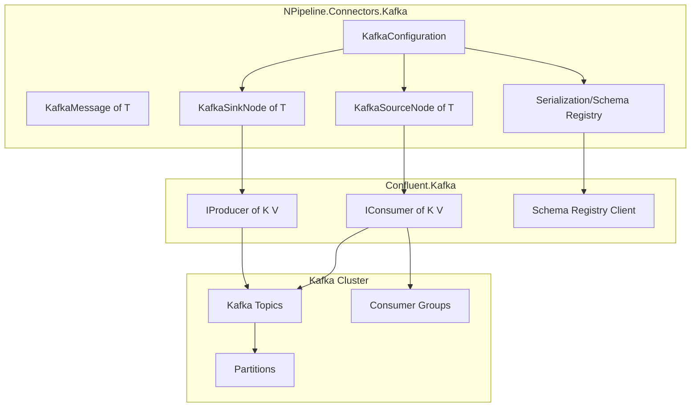
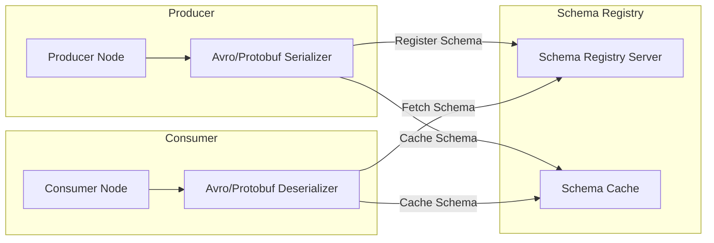
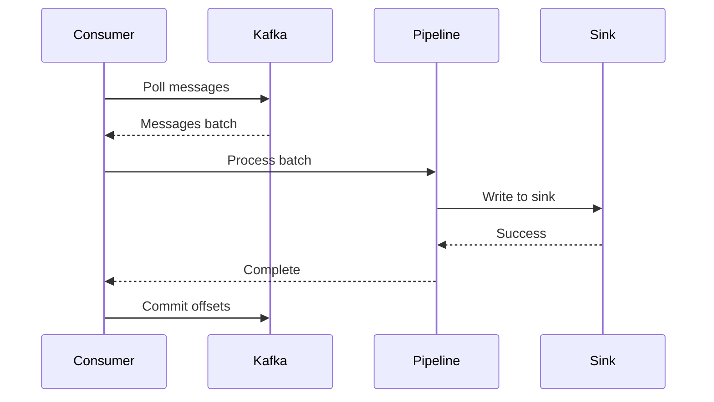
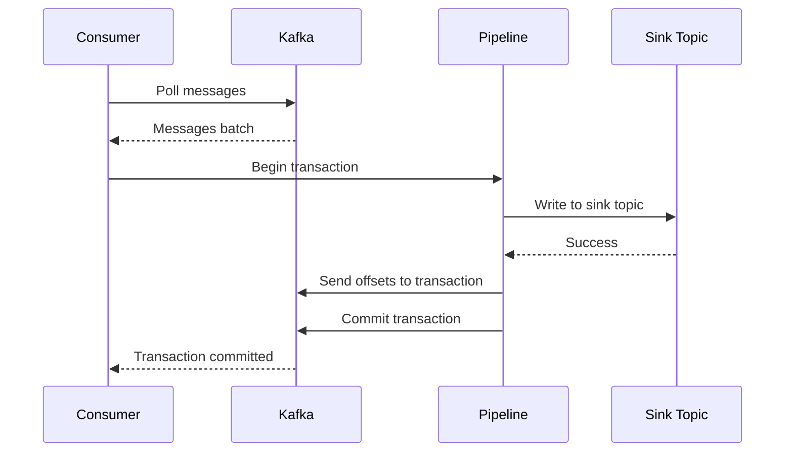

# Kafka Connector Design Plan

## Overview

This document outlines the design for a high-performance Kafka connector for NPipeline, using Confluent.Kafka. The connector will support both source and sink operations with Avro/Protobuf serialization and transactional support.

## Goals

1. **High Performance**: Leverage Kafka's batching, partitioning, and parallel processing capabilities
2. **Great Developer Experience**: Simple configuration, intuitive APIs, comprehensive documentation
3. **Enterprise Features**: Schema Registry integration, exactly-once semantics, transactions

## Architecture Overview



## Project Structure

```
src/NPipeline.Connectors.Kafka/
├── NPipeline.Connectors.Kafka.csproj
├── README.md
├── LogMessages.cs
├── Configuration/
│   ├── KafkaConfiguration.cs
│   ├── KafkaConsumerConfiguration.cs
│   ├── KafkaProducerConfiguration.cs
│   ├── SerializationFormat.cs
│   ├── SchemaRegistryConfiguration.cs
│   └── CompressionType.cs
├── Models/
│   ├── KafkaMessage.cs
│   ├── IKafkaMessageMetadata.cs
│   └── DeadLetterEnvelope.cs
├── Partitioning/
│   ├── IPartitionKeyProvider.cs
│   └── DefaultPartitionKeyProvider.cs
├── Metrics/
│   ├── IKafkaMetrics.cs
│   └── NullKafkaMetrics.cs
├── Retry/
│   ├── IRetryStrategy.cs
│   └── ExponentialBackoffRetryStrategy.cs
├── DeadLetter/
│   └── KafkaDeadLetterSink.cs          # Implements IDeadLetterSink
├── Serialization/
│   ├── ISerializerProvider.cs
│   ├── JsonMessageSerializer.cs
│   ├── AvroMessageSerializer.cs
│   └── ProtobufMessageSerializer.cs
├── Nodes/
│   ├── KafkaSourceNode.cs
│   └── KafkaSinkNode.cs
└── Extensions/
    └── KafkaServiceCollectionExtensions.cs

tests/NPipeline.Connectors.Kafka.Tests/
├── NPipeline.Connectors.Kafka.Tests.csproj
├── Configuration/
│   └── KafkaConfigurationTests.cs
├── Models/
│   └── KafkaMessageTests.cs
├── Partitioning/
│   └── PartitionKeyProviderTests.cs
├── Metrics/
│   └── KafkaMetricsTests.cs
├── Retry/
│   └── RetryStrategyTests.cs
├── DeadLetter/
│   └── KafkaDeadLetterSinkTests.cs
├── Serialization/
│   └── SerializationTests.cs
└── Nodes/
    ├── KafkaSourceNodeTests.cs
    └── KafkaSinkNodeTests.cs

samples/Sample_KafkaConnector/
├── Sample_KafkaConnector.csproj
├── docker-compose.yml
├── Program.cs
├── KafkaConnectorPipeline.cs
├── Order.cs
├── ProcessedOrder.cs
└── Metrics/
    └── ConsoleKafkaMetrics.cs
```

## Component Design

### 1. KafkaConfiguration

The main configuration class that consolidates all Kafka settings:

```csharp
public class KafkaConfiguration
{
    // Connection Settings
    public string BootstrapServers { get; set; }
    public string? ClientId { get; set; }
    public string? SaslUsername { get; set; }
    public string? SaslPassword { get; set; }
    public SecurityProtocol SecurityProtocol { get; set; }
    public SaslMechanism SaslMechanism { get; set; }
    
    // Consumer Settings
    public string SourceTopic { get; set; }
    public string ConsumerGroupId { get; set; }
    public string? GroupInstanceId { get; set; }
    public AutoOffsetReset AutoOffsetReset { get; set; }
    public bool EnableAutoCommit { get; set; }
    public bool EnableAutoOffsetStore { get; set; }
    public int MaxPollRecords { get; set; }
    public int FetchMinBytes { get; set; }
    public int FetchMaxBytes { get; set; }
    public int MaxPartitionFetchBytes { get; set; }
    
    // Producer Settings
    public string SinkTopic { get; set; }
    public bool EnableIdempotence { get; set; }
    public int BatchSize { get; set; }
    public int LingerMs { get; set; }
    public int BatchLingerMs { get; set; }
    public CompressionType CompressionType { get; set; }
    public int MessageMaxBytes { get; set; }
    public Acks Acks { get; set; }
    
    // Serialization
    public SerializationFormat SerializationFormat { get; set; }
    public SchemaRegistryConfiguration? SchemaRegistry { get; set; }
    
    // Delivery Semantics
    public DeliverySemantic DeliverySemantic { get; set; }
    public AcknowledgmentStrategy AcknowledgmentStrategy { get; set; }
    
    // Performance
    public int MaxDegreeOfParallelism { get; set; }
    public bool EnableParallelProcessing { get; set; }
    public int MaxConnectionPoolSize { get; set; }
    public int StatisticsIntervalMs { get; set; }
    
    // Transactions
    public bool EnableTransactions { get; set; }
    public string? TransactionalId { get; set; }
    public IsolationLevel IsolationLevel { get; set; }
    
    // Error Handling
    public int MaxRetries { get; set; }
    public int RetryBaseDelayMs { get; set; }
    public bool ContinueOnError { get; set; }
}
```

### 2. KafkaMessage Model

Implements `IAcknowledgableMessage<T>` for seamless integration:

```csharp
public sealed class KafkaMessage<T> : IAcknowledgableMessage<T>
{
    public T Body { get; }
    public string MessageId { get; }
    public bool IsAcknowledged { get; }
    public IReadOnlyDictionary<string, object> Metadata { get; }
    
    // Kafka-specific properties
    public string Topic { get; }
    public int Partition { get; }
    public long Offset { get; }
    public string Key { get; }
    public DateTime Timestamp { get; }
    public Headers Headers { get; }
    
    public Task AcknowledgeAsync(CancellationToken cancellationToken);
    public IAcknowledgableMessage<TNew> WithBody<TNew>(TNew body);
}
```

### 3. KafkaSourceNode

High-performance consumer with consumer group support:

```csharp
public sealed class KafkaSourceNode<T> : SourceNode<KafkaMessage<T>>
{
    public KafkaSourceNode(KafkaConfiguration configuration);
    public KafkaSourceNode(IConsumer<string, T> consumer, KafkaConfiguration configuration);
    
    public override IDataPipe<KafkaMessage<T>> Initialize(
        PipelineContext context, 
        CancellationToken cancellationToken);
}
```

**Key Features:**

- Consumer group coordination
- Partition assignment and revocation handling
- Configurable offset commit strategies
- Batch consumption for high throughput
- Automatic retry with exponential backoff

### 4. KafkaSinkNode

Producer with batching and transaction support:

```csharp
public sealed class KafkaSinkNode<T> : SinkNode<T>
{
    public KafkaSinkNode(KafkaConfiguration configuration);
    public KafkaSinkNode(IProducer<string, T> producer, KafkaConfiguration configuration);
    
    public override async Task ExecuteAsync(
        IDataPipe<T> input,
        PipelineContext context,
        CancellationToken cancellationToken);
}
```

**Key Features:**

- Batching with configurable linger time
- Compression support
- Transactional producer for exactly-once semantics
- Automatic partition key extraction
- Callback-based acknowledgment

## Serialization Strategy

### Schema Registry Integration



### Supported Formats

1. **JSON** - Default, no schema registry required
2. **Avro** - Schema registry integration, evolution support
3. **Protobuf** - Schema registry integration, compact binary format

## Delivery Semantics

### At-Least-Once (Default)



### Exactly-Once (with Transactions)

**Configuration Notes:**

- Exactly-once requires `EnableIdempotence = true` and `DeliverySemantic = ExactlyOnce`.
- Consumers should use `IsolationLevel.ReadCommitted` when reading transactional output.
- `TransactionalId` must be unique per producer instance to avoid fencing.



## Performance Optimizations

### 1. Batching Strategy

- **Source**: Batch consumption with `MaxPollRecords`
- **Sink**: Configurable `BatchSize` and `LingerMs`
- **Acknowledgment**: Batch offset commits

### 2. Parallel Processing

- Partition-level parallelism
- Configurable `MaxDegreeOfParallelism`
- Thread-safe offset tracking

### 3. Memory Management

- Object pooling for message objects
- Zero-copy deserialization where possible
- Bounded memory usage with backpressure

### 4. Graceful Shutdown

- Stop polling, drain in-flight batches, then commit offsets
- Close producer to flush outstanding deliveries
- Ensure transactional producers abort or commit before shutdown

## Developer Experience Features

### 1. Fluent Configuration

```csharp
var config = new KafkaConfiguration
{
    BootstrapServers = "localhost:9092",
    SourceTopic = "input-topic",
    SinkTopic = "output-topic",
    ConsumerGroupId = "my-consumer-group",
    SerializationFormat = SerializationFormat.Avro,
    SchemaRegistry = new SchemaRegistryConfiguration
    {
        Url = "http://localhost:8081"
    },
    DeliverySemantic = DeliverySemantic.AtLeastOnce,
    AcknowledgmentStrategy = AcknowledgmentStrategy.AutoOnSinkSuccess
};
```

### 2. Simple Pipeline Definition

```csharp
public void Define(PipelineBuilder builder, PipelineContext context)
{
    var source = builder.AddSource<KafkaSourceNode<Order>, KafkaMessage<Order>>(
        "KafkaOrderSource");
    
    var transform = builder.AddTransform<OrderProcessor, KafkaMessage<Order>, KafkaMessage<ProcessedOrder>>(
        "OrderProcessor");
    
    var sink = builder.AddSink<KafkaSinkNode<KafkaMessage<ProcessedOrder>>, KafkaMessage<ProcessedOrder>>(
        "KafkaProcessedOrderSink");
    
    builder.Connect(source, transform);
    builder.Connect(transform, sink);
}
```

### 3. DI Integration

```csharp
services.AddSingleton(KafkaConnectorPipeline.CreateConfiguration());
services.AddKafkaConnector();
```

## Operational Considerations

### 1. Rebalance Safety

- Pause consumption during partition revocation
- Commit offsets for acknowledged items before losing partitions
- Resume with clean state after reassignment

### 2. Observability Hooks

- Optional Confluent statistics handler wired to `IKafkaMetrics`
- Consistent correlation ID propagation via headers (`x-correlation-id`)

### 3. Security and Schema Registry Auth

- Support SASL mechanisms via config
- Schema registry basic auth and optional TLS config

## Testing Strategy

### Unit Tests

1. **Configuration Tests**: Validation, defaults, edge cases
2. **Message Tests**: Acknowledgment, metadata, body transformation
3. **Serialization Tests**: JSON, Avro, Protobuf round-trips
4. **Node Tests**: Mocked consumers/producers

### Integration Tests

1. **Docker Compose**: Kafka + Schema Registry + Zookeeper
2. **End-to-End**: Full pipeline execution
3. **Error Scenarios**: Broker failures, network issues

## Dependencies

```xml
<PackageReference Include="Confluent.Kafka" Version="2.3.0" />
<PackageReference Include="Confluent.SchemaRegistry" Version="2.3.0" />
<PackageReference Include="Confluent.SchemaRegistry.Serdes.Avro" Version="2.3.0" />
<PackageReference Include="Confluent.SchemaRegistry.Serdes.Protobuf" Version="2.3.0" />
```

## Implementation Order

1. Project setup and dependencies
2. Configuration classes with validation
3. KafkaMessage model
4. JSON serialization (simplest first)
5. KafkaSourceNode (basic consumption)
6. KafkaSinkNode (basic production)
7. Unit tests for core components
8. Avro serialization support
9. Protobuf serialization support
10. Transaction support
11. Sample application
12. Documentation

## Resolved Design Decisions

### Custom Partitioners (Opt-in)

Support custom partitioning through a minimal, opt-in abstraction:

```csharp
// Simple key selector for common cases
public Func<T, string>? PartitionKeySelector { get; set; }

// Full abstraction for complex scenarios
public interface IPartitionKeyProvider<T>
{
    string GetPartitionKey(T message);
    int? GetPartition(T message, int partitionCount);
}

// Passthrough for Confluent's native partitioner config
public PartitionerType? PartitionerType { get; set; }
```

### Metrics/Observability

Expose a consistent set of counters and timings via an adapter interface:

```csharp
public interface IKafkaMetrics
{
    // Producer metrics
    void RecordProduced(string topic, int count);
    void RecordProduceLatency(string topic, TimeSpan latency);
    void RecordProduceError(string topic, Exception ex);
    void RecordBatchSize(string topic, int size);
    
    // Consumer metrics
    void RecordConsumed(string topic, int count);
    void RecordPollLatency(string topic, TimeSpan latency);
    void RecordCommitLatency(string topic, TimeSpan latency);
    void RecordCommitError(string topic, Exception ex);
    void RecordLag(string topic, int partition, long lag);
    
    // Serialization metrics
    void RecordSerializeLatency(Type type, TimeSpan latency);
    void RecordDeserializeLatency(Type type, TimeSpan latency);
    void RecordSerializeError(Type type, Exception ex);
    
    // Transaction metrics
    void RecordTransactionCommit(TimeSpan latency);
    void RecordTransactionAbort(TimeSpan latency);
    void RecordTransactionError(Exception ex);
}

// Default no-op implementation
public sealed class NullKafkaMetrics : IKafkaMetrics { ... }
```

### Dead-Letter Integration

Leverage NPipeline's existing [`IDeadLetterSink`](src/NPipeline/ErrorHandling/IDeadLetterSink.cs:90) infrastructure instead of creating a Kafka-specific handler. This provides consistency with other connectors and flexibility for users.

**KafkaDeadLetterSink Implementation:**

```csharp
/// <summary>
///     Dead-letter sink that sends failed items to a Kafka topic.
///     Implements NPipeline's IDeadLetterSink interface for consistency.
/// </summary>
public class KafkaDeadLetterSink : IDeadLetterSink
{
    private readonly IProducer<string, byte[]> _producer;
    private readonly string _deadLetterTopic;
    private readonly ISerializerProvider _serializer;
    
    public KafkaDeadLetterSink(
        IProducer<string, byte[]> producer,
        string deadLetterTopic,
        ISerializerProvider serializer)
    {
        _producer = producer;
        _deadLetterTopic = deadLetterTopic;
        _serializer = serializer;
    }
    
    public async Task HandleAsync(
        string nodeId,
        object item,
        Exception error,
        PipelineContext context,
        CancellationToken cancellationToken)
    {
        // Create dead-letter envelope with metadata
        var envelope = new DeadLetterEnvelope
        {
            NodeId = nodeId,
            OriginalItem = item,
            ExceptionType = error.GetType().FullName,
            ExceptionMessage = error.Message,
            StackTrace = error.StackTrace,
            Timestamp = DateTime.UtcNow,
            CorrelationId = context.CorrelationId,
            // Kafka-specific metadata if item is a KafkaMessage
            OriginalTopic = (item as IKafkaMessageMetadata)?.Topic,
            Partition = (item as IKafkaMessageMetadata)?.Partition,
            Offset = (item as IKafkaMessageMetadata)?.Offset,
        };
        
        var payload = _serializer.Serialize(envelope);
        await _producer.ProduceAsync(_deadLetterTopic, new Message<string, byte[]>
        {
            Key = envelope.CorrelationId ?? Guid.NewGuid().ToString(),
            Value = payload,
            Headers = new Headers
            {
                { "x-dead-letter-reason", Encoding.UTF8.GetBytes(error.GetType().Name) },
                { "x-original-node", Encoding.UTF8.GetBytes(nodeId) },
            }
        }, cancellationToken);
    }
}

/// <summary>
///     Envelope for dead-letter messages containing original item and error details.
/// </summary>
public class DeadLetterEnvelope
{
    public string NodeId { get; set; }
    public object OriginalItem { get; set; }
    public string ExceptionType { get; set; }
    public string ExceptionMessage { get; set; }
    public string StackTrace { get; set; }
    public DateTime Timestamp { get; set; }
    public string CorrelationId { get; set; }
    
    // Kafka-specific metadata (optional)
    public string OriginalTopic { get; set; }
    public int? Partition { get; set; }
    public long? Offset { get; set; }
}
```

**Usage in Configuration:**

```csharp
// Option 1: Use existing in-memory sink (default)
var context = new PipelineContext(PipelineContextConfiguration.Default);

// Option 2: Use Kafka dead-letter topic
var deadLetterSink = new KafkaDeadLetterSink(
    producer, 
    "dead-letter-topic",
    new JsonMessageSerializer());
    
var context = new PipelineContext(
    PipelineContextConfiguration.Default with 
    { 
        DeadLetterSink = deadLetterSink 
    });

// Option 3: Custom implementation (file, database, etc.)
var fileSink = new FileDeadLetterSink("/var/log/pipeline/dead-letters");
var context = new PipelineContext(
    PipelineContextConfiguration.Default with 
    { 
        DeadLetterSink = fileSink 
    });
```

**Design Considerations:**

1. **Non-KafkaMessage items**: When `item` is not a `KafkaMessage<T>`, the sink still creates a valid `DeadLetterEnvelope` with Kafka metadata fields set to `null`. This ensures graceful handling of any item type.

2. **No retry logic in sink**: The `KafkaDeadLetterSink` implements `IDeadLetterSink` contract faithfully - it does not attempt retries. If the produce fails, the exception propagates to NPipeline's error handling infrastructure which manages retries according to its configuration.

3. **DeadLetterEnvelope schema documentation**: The envelope is serialized as JSON by default with the following structure:

```json
{
  "nodeId": "string - ID of the node that failed",
  "originalItem": "object - the original item that failed processing",
  "exceptionType": "string - full type name of the exception",
  "exceptionMessage": "string - exception message",
  "stackTrace": "string? - exception stack trace",
  "timestamp": "datetime - UTC timestamp when the failure occurred",
  "correlationId": "string? - pipeline correlation ID",
  "originalTopic": "string? - Kafka topic (null if not from Kafka)",
  "partition": "int? - Kafka partition (null if not from Kafka)",
  "offset": "long? - Kafka offset (null if not from Kafka)"
}
```

This schema is stable and can be used by downstream consumers to reconstruct failure context.

**Benefits of this approach:**

- Consistent with NPipeline's error handling model
- Works with existing `NodeErrorDecision.DeadLetter`
- Users can choose any sink implementation
- No connector-specific interfaces needed
- Kafka metadata preserved when available
- Graceful handling of non-Kafka items
- Well-documented schema for interoperability

### Configuration Validation

Add comprehensive validation with clear error messages:

```csharp
public virtual void Validate()
{
    ValidateSource();
    ValidateSink();
    ValidateSerialization();
    ValidateTransactions();
}

private void ValidateTransactions()
{
    if (EnableTransactions && string.IsNullOrWhiteSpace(TransactionalId))
        throw new InvalidOperationException(
            "TransactionalId is required when EnableTransactions is true.");
            
    if (EnableTransactions && DeliverySemantic != DeliverySemantic.ExactlyOnce)
        throw new InvalidOperationException(
            "Transactions require DeliverySemantic.ExactlyOnce.");

    if (EnableTransactions && !EnableIdempotence)
        throw new InvalidOperationException(
            "EnableIdempotence is required when EnableTransactions is true.");
}

private void ValidateSerialization()
{
    if (SerializationFormat == SerializationFormat.Avro && SchemaRegistry == null)
        throw new InvalidOperationException(
            "SchemaRegistry configuration is required for Avro serialization.");
            
    if (SerializationFormat == SerializationFormat.Protobuf && SchemaRegistry == null)
        throw new InvalidOperationException(
            "SchemaRegistry configuration is required for Protobuf serialization.");
}
```

### Error Handling with Retry Strategy

Extensible retry logic:

```csharp
public interface IRetryStrategy
{
    bool ShouldRetry(Exception ex, int attempt);
    TimeSpan GetDelay(int attempt);
}

public class ExponentialBackoffRetryStrategy : IRetryStrategy
{
    public int MaxRetries { get; set; } = 3;
    public int BaseDelayMs { get; set; } = 100;
    public int MaxDelayMs { get; set; } = 30000;
    public double JitterFactor { get; set; } = 0.2;
    
    public bool ShouldRetry(Exception ex, int attempt) => attempt < MaxRetries;
    
    public TimeSpan GetDelay(int attempt)
    {
        var delay = Math.Min(BaseDelayMs * Math.Pow(2, attempt), MaxDelayMs);
        var jitter = delay * JitterFactor * Random.Shared.NextDouble();
        return TimeSpan.FromMilliseconds(delay + jitter);
    }
}
```
