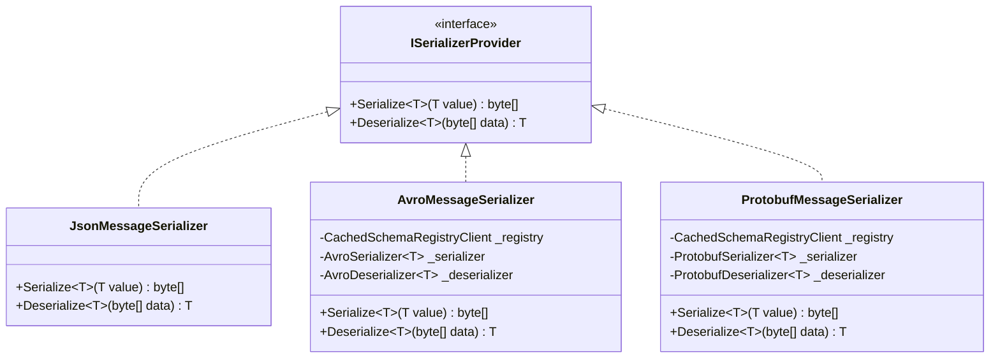
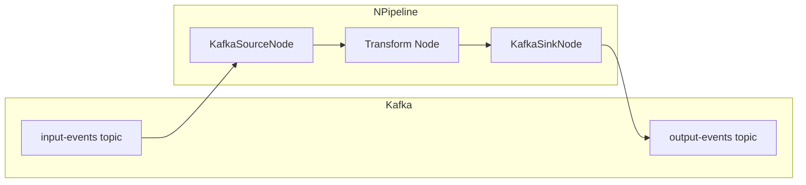

# Kafka Connector Improvements Plan

## Overview

This plan addresses gaps identified during code review of the `kafka-connector` branch:

1. ~~**Incomplete Serialization**: Avro and Protobuf serialization throw `NotSupportedException` despite the project referencing Confluent.SchemaRegistry packages~~ ✅ **COMPLETED**
2. ~~**Sample Doesn't Run Pipeline**: The Sample_KafkaConnector only creates nodes but doesn't demonstrate actual pipeline execution~~ ✅ **COMPLETED**
3. ~~**Failing Unit Test**: `KafkaMessageTests.Constructor_WithNullAcknowledgeCallback_ShouldThrow` expects an exception but null is a valid value~~ ✅ **COMPLETED**

## Architecture

### Serialization Architecture



### Sample Pipeline Flow



## Detailed Tasks

### Task 1: Fix Failing Unit Test

**File:** `tests/NPipeline.Connectors.Kafka.Tests/Models/KafkaMessageTests.cs`

**Problem:** The test at line 69-82 expects `ArgumentNullException` when passing null for the acknowledge callback, but the constructor accepts null as a valid value (for exactly-once semantics where acknowledgment is handled via `SendOffsetsToTransaction`).

**Solution:** Update the test to reflect that null is a valid value:

```csharp
[Fact]
public void Constructor_WithNullAcknowledgeCallback_ShouldNotThrow()
{
    // Arrange & Act
    var message = new KafkaMessage<TestMessage>(
        new TestMessage { Id = 1, Name = "Test" },
        "test-topic",
        0,
        0,
        "key",
        DateTime.UtcNow,
        new Headers(),
        null); // null is valid for exactly-once semantics

    // Assert
    message.IsAcknowledged.Should().BeFalse();
}
```

### Task 2: Implement Avro Serialization

**Files to Create/Modify:**

- Create: `src/NPipeline.Connectors.Kafka/Serialization/AvroMessageSerializer.cs`
- Modify: `src/NPipeline.Connectors.Kafka/Nodes/KafkaSourceNode.cs` (line 290-303)
- Modify: `src/NPipeline.Connectors.Kafka/Nodes/KafkaSinkNode.cs` (line 543-554)

**Implementation Notes:**

- Use `Confluent.SchemaRegistry.Serdes.Avro` package (already referenced)
- Create `CachedSchemaRegistryClient` from `SchemaRegistryConfiguration`
- Use `AvroSerializer<T>` and `AvroDeserializer<T>` from Confluent
- Handle generic Avro types (ISpecificRecord) vs reflection-based GenericRecord
- Cache serializers/deserializers per type for performance

### Task 3: Implement Protobuf Serialization

**Files to Create/Modify:**

- Create: `src/NPipeline.Connectors.Kafka/Serialization/ProtobufMessageSerializer.cs`
- Modify: `src/NPipeline.Connectors.Kafka/Nodes/KafkaSourceNode.cs` (line 290-303)
- Modify: `src/NPipeline.Connectors.Kafka/Nodes/KafkaSinkNode.cs` (line 543-554)

**Implementation Notes:**

- Use `Confluent.SchemaRegistry.Serdes.Protobuf` package (already referenced)
- Create `CachedSchemaRegistryClient` from `SchemaRegistryConfiguration`
- Use `ProtobufSerializer<T>` and `ProtobufDeserializer<T>` from Confluent
- Requires IMessage interface constraint on generic type T
- Cache serializers/deserializers per type for performance

### Task 4: Update Sample to Run Actual Pipeline

**File:** `samples/Sample_KafkaConnector/Program.cs`

**Current State:** Only creates nodes, doesn't run a pipeline

**Solution:** Create a complete pipeline demonstration:

1. Create `samples/Sample_KafkaConnector/KafkaPipeline.cs` - Define a pipeline that:
   - Reads from `input-events` topic via `KafkaSourceNode<SampleMessage>`
   - Transforms/enriches messages (optional transform node)
   - Writes to `output-events` topic via `KafkaSinkNode<SampleMessage>`

2. Update `Program.cs` to:
   - Use `PipelineRunnerBuilder` to construct and run the pipeline
   - Include graceful shutdown handling (Ctrl+C)
   - Show both console output and proper error handling

3. Add `README.md` with:
   - Prerequisites (Docker Compose for local Kafka)
   - How to create required topics
   - How to run the sample

### Task 5: Add Integration Test Documentation

**File:** Create `src/NPipeline.Connectors.Kafka.Tests/README.md` or add to main README

**Content:**

- Explain that integration tests require a running Kafka instance
- Provide Docker Compose snippet for local testing
- Document environment variables for test configuration
- Consider adding `[SkipIfNoKafka]` attribute pattern for CI/CD

## Implementation Order

1. **Fix failing test** (Task 1) - Quick fix, unblocks CI
2. **Implement Avro serialization** (Task 2) - Higher demand feature
3. **Implement Protobuf serialization** (Task 3) - Similar to Avro
4. **Update sample** (Task 4) - Demonstrates working connector
5. **Add test documentation** (Task 5) - Improves developer experience

## Questions for Discussion

1. Should Avro/Protobuf serializers be in separate files or combined with factory pattern?
2. Do we need to support both specific record (generated classes) and generic record for Avro?
3. Should the sample include a docker-compose.yml for easy local testing?
4. Should we add a mock/in-memory Kafka implementation for unit tests?
