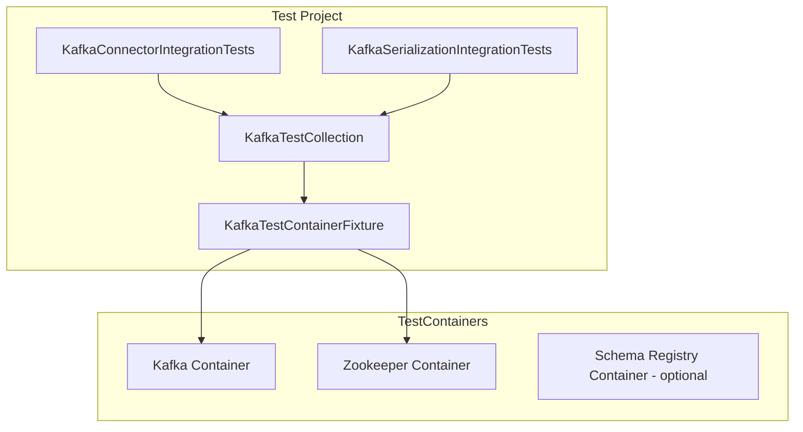

# Kafka Integration Tests Implementation Plan

## Overview

Add integration tests for the Kafka connector using TestContainers, following the established patterns from PostgreSQL and SqlServer connector tests.

## Architecture

### Test Infrastructure



### File Structure

```
tests/NPipeline.Connectors.Kafka.Tests/
├── NPipeline.Connectors.Kafka.Tests.csproj  # Add Testcontainers.Kafka package
├── Fixtures/
│   ├── KafkaTestContainerFixture.cs         # NEW: Manages Kafka container lifecycle
│   └── KafkaTestCollection.cs               # NEW: xUnit collection definition
├── Integration/
│   ├── KafkaConnectorIntegrationTests.cs    # NEW: End-to-end source/sink tests
│   └── KafkaSerializationIntegrationTests.cs # NEW: Serialization format tests
└── README.md                                # UPDATE: Add TestContainers info
```

## Detailed Tasks

### Task 1: Add TestContainers.Kafka Package

**File:** `tests/NPipeline.Connectors.Kafka.Tests/NPipeline.Connectors.Kafka.Tests.csproj`

Add the Testcontainers.Kafka package reference:

```xml
<PackageReference Include="Testcontainers.Kafka" Version="4.10.0"/>
```

Also add required project references:

```xml
<ProjectReference Include="..\..\src\NPipeline.Extensions.Testing.AwesomeAssertions\NPipeline.Extensions.Testing.AwesomeAssertions.csproj"/>
<ProjectReference Include="..\..\src\NPipeline.Extensions.DependencyInjection\NPipeline.Extensions.DependencyInjection.csproj"/>
<ProjectReference Include="..\..\src\NPipeline\NPipeline.csproj"/>
<ProjectReference Include="..\..\src\NPipeline.Connectors\NPipeline.Connectors.csproj"/>
```

### Task 2: Create KafkaTestContainerFixture

**File:** `tests/NPipeline.Connectors.Kafka.Tests/Fixtures/KafkaTestContainerFixture.cs`

Follow the pattern from [`PostgresTestContainerFixture.cs`](tests/NPipeline.Connectors.PostgreSQL.Tests/Fixtures/PostgresTestContainerFixture.cs:1):

```csharp
using Testcontainers.Kafka;

namespace NPipeline.Connectors.Kafka.Tests.Fixtures;

public class KafkaTestContainerFixture : IAsyncLifetime
{
    private readonly KafkaContainer _container;

    public KafkaTestContainerFixture()
    {
        _container = new KafkaBuilder()
            .WithImage("confluentinc/cp-kafka:7.5.0")
            .WithReuse(true)
            .WithLabel("npipeline-test", "kafka-integration")
            .Build();
    }

    public string BootstrapServers => _container.GetBootstrapAddress();

    public async Task InitializeAsync()
    {
        await _container.StartAsync();
    }

    public async Task DisposeAsync()
    {
        await _container.DisposeAsync();
    }
}
```

### Task 3: Create KafkaTestCollection

**File:** `tests/NPipeline.Connectors.Kafka.Tests/Fixtures/KafkaTestCollection.cs`

Follow the pattern from [`PostgresTestCollection.cs`](tests/NPipeline.Connectors.PostgreSQL.Tests/Fixtures/PostgresTestCollection.cs:1):

```csharp
namespace NPipeline.Connectors.Kafka.Tests.Fixtures;

[CollectionDefinition("Kafka")]
public class KafkaTestCollection : ICollectionFixture<KafkaTestContainerFixture>
{
    // This class has no code; it's just a marker for xUnit collection fixture
}
```

### Task 4: Create KafkaConnectorIntegrationTests

**File:** `tests/NPipeline.Connectors.Kafka.Tests/Integration/KafkaConnectorIntegrationTests.cs`

Follow the pattern from [`PostgresConnectorIntegrationTests.cs`](tests/NPipeline.Connectors.PostgreSQL.Tests/Integration/PostgresConnectorIntegrationTests.cs:1).

Key test scenarios:

1. **EndToEnd_SourceToSink_TransfersDataCorrectly**
   - Create topic using AdminClient
   - Produce test messages to input topic
   - Create KafkaSourceNode and consume messages
   - Create KafkaSinkNode and produce to output topic
   - Verify messages received on output topic

2. **ConsumerGroup_RebalancesCorrectly**
   - Test consumer group behavior with multiple consumers

3. **AtLeastOnce_DeliverySemantic_CommitsOffsets**
   - Verify offset commit behavior for at-least-once

4. **PartitionKeyProvider_RoutesToCorrectPartition**
   - Test partition routing based on message key

5. **BatchProcessing_HandlesMultipleMessages**
   - Test batch consumption and production

### Task 5: Create KafkaSerializationIntegrationTests

**File:** `tests/NPipeline.Connectors.Kafka.Tests/Integration/KafkaSerializationIntegrationTests.cs`

Test scenarios for serialization:

1. **JsonSerialization_RoundTripsCorrectly**
   - Test JSON serialization/deserialization

2. **AvroSerialization_RoundTripsCorrectly** (requires Schema Registry)
   - Test Avro serialization with Schema Registry
   - Note: May need to add Schema Registry container

3. **ProtobufSerialization_RoundTripsCorrectly** (requires Schema Registry)
   - Test Protobuf serialization with Schema Registry
   - Note: May need to add Schema Registry container

### Task 6: Update README

**File:** `tests/NPipeline.Connectors.Kafka.Tests/README.md`

Update to include TestContainers information:

- How TestContainers works
- Docker requirement
- Container reuse configuration
- Running integration tests specifically

## Implementation Notes

### TestContainers Kafka

The `Testcontainers.Kafka` package provides a pre-configured Kafka container that includes:

- Kafka broker
- Embedded Zookeeper (or separate container)
- Automatic port mapping

### Schema Registry Consideration

For Avro and Protobuf serialization tests, we need Schema Registry. Options:

1. **Use Testcontainers.Network** to link Kafka + Schema Registry containers
2. **Skip Schema Registry tests** in initial implementation and add later
3. **Use mock Schema Registry** for unit tests

Recommendation: Start with JSON serialization tests, add Schema Registry container in follow-up.

### Test Message Types

Define test message types similar to PostgreSQL tests:

```csharp
public record TestMessage
{
    public Guid Id { get; init; }
    public string EventType { get; init; } = string.Empty;
    public DateTime Timestamp { get; init; }
    public object? Payload { get; init; }
}
```

## Questions for Discussion

1. Should we include Schema Registry container from the start, or add it in a follow-up?
2. What level of test coverage do we need for exactly-once semantics?
3. Should we add performance/stress tests with large message batches?
