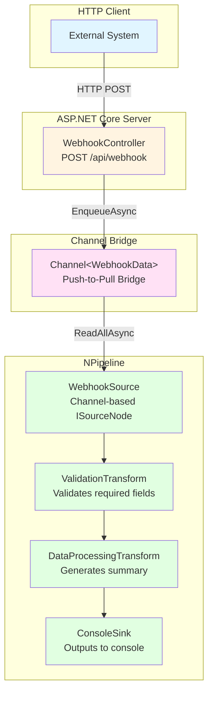

# Sample_HttpPost - HTTP POST Webhook Processing

This sample demonstrates how to receive HTTP POST requests and flow the data through a pipeline using a channel-based source node. It showcases the *
*push-to-pull bridge pattern** where HTTP POST requests push data into a `Channel<T>`, which is then read by a channel-based source node and exposed as
`IDataPipe<T>` for processing through the pipeline.

## Overview

The Sample_HttpPost application is a complete ASP.NET Core web application that:

1. Receives webhook data via HTTP POST requests
2. Enqueues the data into a channel for asynchronous processing
3. Validates and transforms the data through a pipeline
4. Outputs the processed results to the console

This pattern is ideal for scenarios where you need to:

- Process incoming HTTP requests asynchronously
- Decouple request handling from processing logic
- Implement backpressure handling
- Process high-volume webhook events efficiently

## Architecture

### High-Level Architecture



### Data Flow

```mermaid
sequenceDiagram
    participant Client as HTTP Client
    participant Controller as WebhookController
    participant Channel as Channel&lt;WebhookData&gt;
    participant Source as WebhookSource
    participant Validation as ValidationTransform
    participant Processing as DataProcessingTransform
    participant Sink as ConsoleSink

    Client->>Controller: POST /api/webhook
    Controller->>Channel: EnqueueAsync(webhookData)
    Controller-->>Client: 202 Accepted

    Source->>Channel: ReadAllAsync()
    Channel-->>Source: webhookData
    Source->>Validation: ExecuteAsync(webhookData)
    Validation->>Validation: Validate fields
    Validation-->>Processing: ValidatedWebhookData
    Processing->>Processing: Generate summary
    Processing-->>Sink: ProcessedData
    Sink->>Sink: Output to console
```

## How the Channel-Based Source Works

The key innovation in this sample is the `WebhookSource` class, which implements the **push-to-pull bridge pattern**:

### Push Side (HTTP Controller)

```csharp
// The HTTP controller pushes data into the channel
await _webhookSource.EnqueueAsync(webhookData, cancellationToken);
```

- Multiple concurrent HTTP requests can write to the channel
- The channel acts as a buffer, decoupling request handling from processing
- Returns immediately with HTTP 202 Accepted

### Pull Side (Pipeline Source)

```csharp
// The pipeline pulls data from the channel
await foreach (var item in _channel.Reader.ReadAllAsync(ct))
{
    yield return item;
}
```

- The pipeline reads from the channel at its own pace
- Implements backpressure naturally (if processing is slow, the channel fills up)
- Continues processing until the channel is completed or canceled

### Channel Configuration

```csharp
_channel = Channel.CreateUnbounded<WebhookData>(new UnboundedChannelOptions
{
    SingleReader = true,  // Only the pipeline reads from this channel
    SingleWriter = false  // Multiple HTTP requests can write concurrently
});
```

## Project Structure

```
Sample_HttpPost/
├── Controllers/
│   └── WebhookController.cs      # HTTP endpoint for receiving webhooks
├── Models/
│   ├── WebhookData.cs            # Incoming webhook data model
│   ├── ValidatedWebhookData.cs   # Data after validation
│   └── ProcessedData.cs          # Final processed data model
├── Nodes/
│   ├── WebhookSource.cs          # Channel-based source node
│   ├── ValidationTransform.cs    # Validates webhook data
│   ├── DataProcessingTransform.cs # Processes validated data
│   └── ConsoleSink.cs            # Outputs to console
├── WebhookPipeline.cs            # Pipeline definition
├── Program.cs                    # Application entry point
├── Sample_HttpPost.csproj        # Project file
└── README.md                     # This file
```

## Pipeline Flow

The pipeline processes webhook data through the following stages:

1. **WebhookSource**: Reads webhook data from a channel (pushed by HTTP POST requests)
2. **ValidationTransform**: Validates webhook data according to business rules
3. **DataProcessingTransform**: Processes validated data and generates a summary
4. **ConsoleSink**: Outputs the final processed data to the console

## Running the Sample

### Prerequisites

- .NET 8.0, 9.0, or 10.0 SDK
- A terminal or command prompt

### Build and Run

1. Navigate to the sample directory:

   ```bash
   cd samples/Sample_HttpPost
   ```

2. Restore dependencies:

   ```bash
   dotnet restore
   ```

3. Run the application:

   ```bash
   dotnet run
   ```

The application will start and display:

```
=== NPipeline Sample: HTTP POST Webhook Processing ===

Registered NPipeline services and scanned assemblies for nodes.

Pipeline Description:
[Pipeline description displayed]

Starting pipeline execution in background...

Starting web server...
Webhook endpoint available at: http://localhost:5000/api/webhook
Status endpoint available at: http://localhost:5000/api/webhook/status

Press Ctrl+C to stop the application.
```

## Testing the Sample

### Using curl

#### Send a Simple Webhook

```bash
curl -X POST http://localhost:5000/api/webhook \
  -H "Content-Type: application/json" \
  -d '{
    "id": "webhook-001",
    "eventType": "user.created",
    "payload": {
      "userId": "12345",
      "username": "john.doe",
      "email": "john@example.com"
    },
    "timestamp": "2024-01-15T10:30:00Z"
  }'
```

#### Send a Payment Event

```bash
curl -X POST http://localhost:5000/api/webhook \
  -H "Content-Type: application/json" \
  -d '{
    "id": "webhook-002",
    "eventType": "payment.completed",
    "payload": {
      "paymentId": "pay_abc123",
      "amount": 99.99,
      "currency": "USD",
      "customerId": "cust_456"
    },
    "timestamp": "2024-01-15T10:31:00Z"
  }'
```

#### Send an Order Event

```bash
curl -X POST http://localhost:5000/api/webhook \
  -H "Content-Type: application/json" \
  -d '{
    "id": "webhook-003",
    "eventType": "order.placed",
    "payload": {
      "orderId": "ord_789",
      "productId": "prod_123",
      "quantity": 2,
      "total": 149.98
    },
    "timestamp": "2024-01-15T10:32:00Z"
  }'
```

#### Check Status

```bash
curl http://localhost:5000/api/webhook/status
```

### Using PowerShell

```powershell
Invoke-RestMethod -Method Post -Uri "http://localhost:5000/api/webhook" `
  -ContentType "application/json" `
  -Body '{
    "id": "webhook-001",
    "eventType": "user.created",
    "payload": {
      "userId": "12345",
      "username": "john.doe",
      "email": "john@example.com"
    },
    "timestamp": "2024-01-15T10:30:00Z"
  }'
```

### Using Postman

1. Create a new POST request to `http://localhost:5000/api/webhook`
2. Set the Content-Type header to `application/json`
3. Add the webhook data in the request body
4. Send the request

### Expected Output

When you send a webhook, you'll receive a 202 Accepted response:

```json
{
  "status": "Accepted",
  "message": "Webhook enqueued for processing",
  "webhookId": "webhook-001",
  "eventType": "user.created",
  "queuedCount": 0
}
```

The console will show the processing output:

```
=== PROCESSED WEBHOOK DATA ===

Timestamp           | ID           | Event Type              | Summary
---------------------|--------------|-------------------------|--------------------------------------------------
2024-01-15 10:30:01 | webhook-001  | user.created            | Event 'user.created' received 1234ms ago with payload keys: [userId, username, email]

=== SUMMARY ===
Total webhooks processed: 1
```

## Key Concepts Demonstrated

### 1. Push-to-Pull Bridge Pattern

This pattern bridges the gap between push-based (HTTP requests) and pull-based (pipeline processing) systems:

- **Push side**: HTTP controllers push data into a channel
- **Pull side**: Pipeline pulls data from the channel as needed
- **Benefits**: Decouples request handling from processing, natural backpressure

### 2. Channel-Based Source Node

The `WebhookSource` implements `ISourceNode<WebhookData>` and uses `System.Threading.Channels`:

- Uses `Channel<T>` for thread-safe communication
- Provides `EnqueueAsync()` method for external push operations
- Returns `StreamingDataPipe<T>` from `Initialize()` for pipeline consumption

### 3. Singleton Registration

The `WebhookSource` is registered as a singleton:

```csharp
services.AddSingleton<WebhookSource>();
```

This ensures both the HTTP controller and the pipeline access the same channel instance.

### 4. Real-Time Processing

The pipeline runs continuously in the background, processing webhooks as they arrive:

- No polling required
- Immediate processing upon webhook receipt
- Efficient resource utilization

### 5. Error Handling and Validation

- Validation transform ensures data quality
- Proper exception handling throughout the pipeline
- Logging at each stage for observability

## Production Considerations

When adapting this sample for production, consider:

### 1. Channel Capacity

Use a bounded channel to prevent memory issues:

```csharp
_channel = Channel.CreateBounded<WebhookData>(new BoundedChannelOptions(1000)
{
    FullMode = BoundedChannelFullMode.Wait,
    SingleReader = true,
    SingleWriter = false
});
```

### 2. Persistence

Consider adding persistence for webhooks to handle failures:

- Store webhooks in a database before enqueuing
- Implement retry logic for failed webhooks
- Add dead-letter queue for problematic webhooks

### 3. Monitoring

Add comprehensive monitoring:

- Metrics for queue depth, processing time, error rates
- Health check endpoints
- Distributed tracing

### 4. Security

- Add authentication/authorization to the webhook endpoint
- Validate webhook signatures
- Rate limiting to prevent abuse

### 5. Scaling

- Consider multiple pipeline instances for high throughput
- Use a message broker (e.g., RabbitMQ, Azure Service Bus) for distributed scenarios
- Implement horizontal scaling of the web server

## Implementation Details

### WebhookSource

The channel-based source node:

- Implements `ISourceNode<WebhookData>`
- Uses `Channel<WebhookData>` internally
- Provides `EnqueueAsync()` for HTTP endpoints to push data
- Returns `StreamingDataPipe<WebhookData>` from `Initialize()`

### ValidationTransform

Validates webhook data:

- Checks required fields (Id, EventType, Payload)
- Validates field formats and constraints
- Throws `ArgumentException` on validation failure

### DataProcessingTransform

Processes validated data:

- Generates a human-readable summary from the payload
- Calculates processing delay
- Returns `ProcessedData` record

### ConsoleSink

Outputs processed data:

- Formats and displays each processed webhook
- Shows summary statistics
- Logs processing progress

## Troubleshooting

### Webhook Not Processed

If a webhook is accepted but not processed:

1. Check the console logs for errors
2. Verify the pipeline is running
3. Check the status endpoint: `curl http://localhost:5000/api/webhook/status`

### High Memory Usage

If memory usage is high:

1. Consider using a bounded channel
2. Monitor the queue depth
3. Check for webhooks stuck in validation

### Pipeline Stops Processing

If the pipeline stops processing:

1. Check for unhandled exceptions
2. Verify cancellation tokens are not being triggered
3. Review logs for error messages
